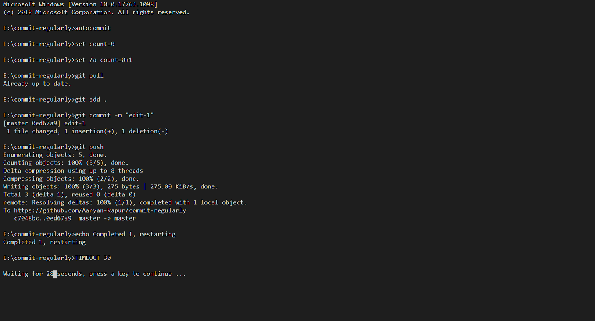

# commit-regularly
Git commit and push

An extremely simple scipt to commit every few seconds, will only commit if you have made any changes!
Yes, it will push for you!
Yes, it will also pull for you!

## Customize

cd "path" : replace path with your folder path/ If you are placing this file inside local repository folder, remove this line completely
 
 
"edit" : Currently the commit message is edit you can change this!
 
 
TIMEOUT 30 : Determines time between 2 commits.

## Usage
<ol>
<li>Download the batch file </li>
<li>Place it according to your need</li>
<li>Open CMD and type autocommit (or the name of the batch file")
<li>press enter
<li>See the magic happen
<li>Turn on autosave for commits staying

## In the works

